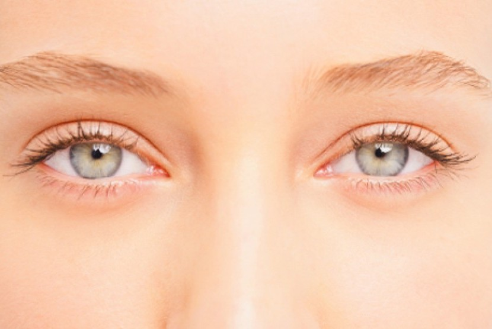

<!--StartFragment-->

**Mata** adalah panca indera manusia yang sangat penting/esensial. Dapat dibayangkan jika kita mengalami kerusakan mata atau kebutaan, kita tidak dapat menikmati dan merasakan betapa indahnya alam semesta ini.

Kenyataannya kita sering lupa untuk melakukan *perawatan mata*, padahal seperti halnya bagian tubuh yang lain, mata mungkin saja terkena gangguan atau masalah kesehatan. Gangguan-ganguan tersebut bisa disebabkan oleh udara yang tidak bersih atau terpolusi, radiasi sinar matahari, radiasi akibat terlalu lama di depan komputer, dan gangguan-gangguan lainnya.

Studi yang dilakukan oleh Eye Disease Prevalence Research Group (2004) memperkirakan bahwa pada tahun 2020 jumlah penderita penyakit mata dan kebutaan di dunia akan mencapai 55 juta jiwa. Studi ini menyebutkan juga bahwa penyakit mata dan kebutaan akan meningkat terutama bagi mereka yang telah berumur diatas 65 tahun. Seseorang yang berumur 80 tahun ke atas yang merupakan 8% dari total penduduk, mengalami kebutaan sebanyak 69%.

Gangguan kesehatan mata yang umum terjadi adalah penurunan fungsi penglihatan, gejala mata merah tanpa ada penurunan fungsi penglihatan, dan mata merah dengan fungsi penglihatan turun. Sampai saat ini, penyakit mata yang banyak diderita adalah katarak, glukoma, dan infeksi.

Sampai saat ini aktivitas antioksidan dari senyawa lutein, zeaxanthin, dan astaxanthin memberi jawaban mekanisme terjadinya peningkatan kesehatan mata. Radikal bebas yang berasal dari sinar UV atau cemaran udara, masuk ke mata mengakibatkan terjadinya reaksi oksidasi molekul-molekul rentan pada lensa mata.

<!--EndFragment-->