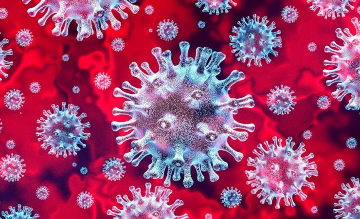

Virus Corona atau severe acute respiratory syndrome coronavirus 2 (SARS-CoV-2) adalah virus yang menyerang sistem pernapasan. Penyakit karena infeksi virus ini disebut COVID-19. Virus Corona bisa menyebabkan gangguan ringan pada sistem pernapasan, infeksi paru-paru yang berat, hingga kematian.

Severe acute respiratory syndrome coronavirus 2 (SARS-CoV-2) yang lebih dikenal dengan nama virus Corona adalah jenis baru dari coronavirus yang menular ke manusia. Virus ini bisa menyerang siapa saja, seperti lansia (golongan usia lanjut), orang dewasa, anak-anak, dan bayi, termasuk ibu hamil dan ibu menyusui.

Infeksi virus Corona disebut COVID-19 (Corona Virus Disease 2019) dan pertama kali ditemukan di kota Wuhan, China pada akhir Desember 2019. Virus ini menular dengan sangat cepat dan telah menyebar ke hampir semua negara, termasuk Indonesia, hanya dalam waktu beberapa bulan.

Hal tersebut membuat beberapa negara menerapkan kebijakan untuk memberlakukan lockdown dalam rangka mencegah penyebaran virus Corona. Di Indonesia sendiri, diberlakukan kebijakan Pembatasan Sosial Berskala Besar (PSBB) untuk menekan penyebaran virus ini.

